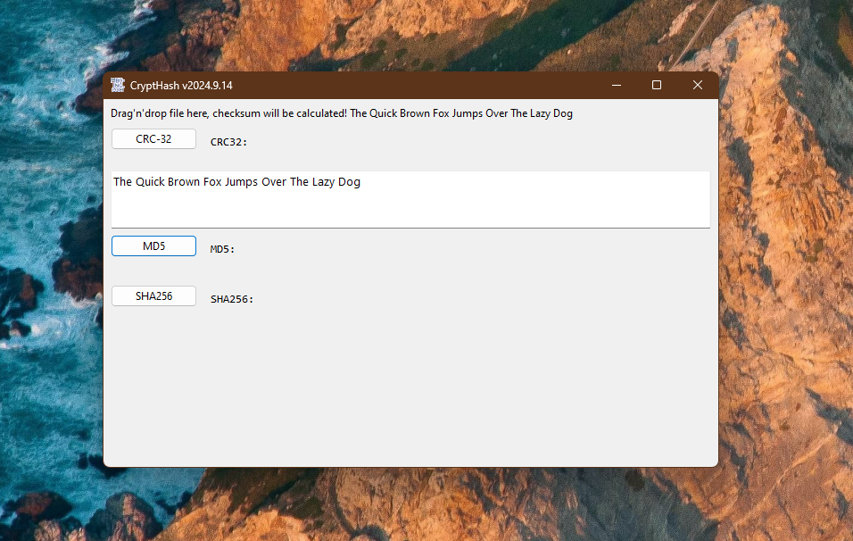

# Crypt_Hash  
## 50 years of hashing CRC32, MD5, SHA, SHA-256

 

In the field of cryptorgraphy different very interesting and sophisticated algorithms for different purposes specific to IT-security were invented and evolved in the past 50 years.   
Here e.g. the evolution of checksum-algorithms, for checking if transfered or transmitted data is still correct or meanwhile corrupted.   
This repo started in sept 2024. However collecting the codes at ActiveVB already began in the early 2K-years.   

Some Links:  
[ActiveVB Crypting-class](http://www.activevb.de/rubriken/klassen/sonstige/ccrypt.html)  
[MSCrypt-API: CryptAcquireContext](https://learn.microsoft.com/de-de/windows/win32/api/wincrypt/nf-wincrypt-cryptacquirecontexta)   
[CNG Crypt-Next-Generation MS-BCrypt-API:](https://learn.microsoft.com/de-de/windows/win32/api/bcrypt/)  
[The Difference Between SHA-1, SHA-2 and SHA-256 Hash-Algorithms](https://www.thesslstore.com/blog/difference-sha-1-sha-2-sha-256-hash-algorithms/)  
[Creating a Hash with CNG](https://learn.microsoft.com/en-us/windows/win32/seccng/creating-a-hash-with-cng)  
  

